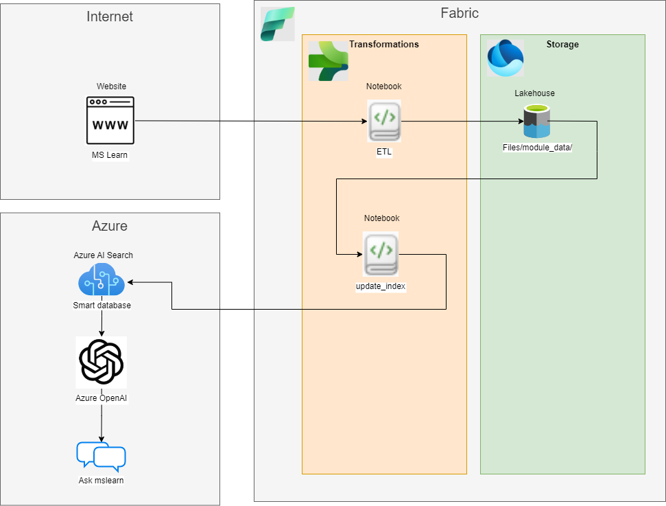

## Ask MSlearn
This is the repo for our contribution to the Microsoft Fabric community AI hack competition.
The authors are Richard Martin and Mårten Sjö (GH: mrmarten).
> The solution presented here has not been exposed to the full mslearn dataset due to time and cost constraints for processing data.

## Selling pitch

### Skill Syncing: Unlock Your Potential with Precision Learning Pathways
 
In the swiftly evolving technological landscape, maintaining a competitive edge goes beyond mere knowledge acquisition—it demands rapid learning and adaptability. Skill Syncing is a groundbreaking service that redefines professional skill development by leveraging Microsoft Learn, Microsoft Fabric, and Azure OpenAI with RAG technology. It eliminates upskilling uncertainties by thoroughly analyzing your resume or CV, For instance, if you are a .NET developer, Skill Syncing identifies your role and then customizes a learning pathway that is uniquely tailored to you. Skill Syncing then guides you to enhance your .NET expertise with relevant and complementary new skills like Azure DevOps as market demands progress over time, or to discover new technologies that align with your career goals. Serving as your personalized guide on Microsoft Learn, Skill Syncing ensures that you don’t just keep up with the technological race but lead the way in your professional growth.

## Introduction
Our idea for this competition was to provide an interactive chat-interface to the articles on [mslearn](https://learn.microsoft.com). The mslearn database is a vast resource with information on many different Microsoft products and tools. It is navigable through tags and collections like *modules* and *learning paths*, but it can still be tricky to find just the article you need in a particular situation since they overlap on certain topics. We wanted to make it easier to filter through the modules in the mslearn library, and we wanted to extend the functionality from just finding and reading up on certain topics, to being able to automatically find **all** modules related to some topic, so that it's easier to compare the different tools, products and methods. We do this by creating an interactive chat-like experience where you explain your problem/situation to an AI and get recommendations based on the knowledge in mslearn.
For example you could:
* Post your resume to get suggestions of tools and products that you might be interested in
* Describe a workflow and get suggestions for tools and products that might help you get the work done

## Design
Here we present our solution. It has three major parts. Everything was coded in Python.

### 1. ETL
We utilized the open [API](https://learn.microsoft.com/en-us/training/support/catalog-api) to Microsoft learn to collect metadata about all the available modules. With this metadata we then crawled the [mslearn website](https://learn.microsoft.com) and downloaded the text content of each module. We note that a more sophisticated approach would be to download the structured markdown content along with figures, but that was not possible within the time frame of this project.
The code for this was done in Fabric notebooks in our project workspace. The data was stored as files in a lakehouse.

### 2. Indexing
We then set up a search index in Azure AI Search. For this implementation we choose a few categorical fields and a few text fields. We note that this index can be further refined in the future to allow better search results, but again, it was not feasible within the time frame. Furthermore we calculated a vector field with embeddings of the text content in the modules and added to the index. This was done with Azure OpenAI ada-002.
The code for this step was also a Fabric notebook. Reading data from our lakehouse and pushing it to our Azure AI Search resource.

### 3. Chat interface with Retrieval Augmented Generation (RAG)
The final step was to connect our smart database (with our Azure AI Search index) to a chat GPT-like interface where the user could ask questions. We used the standard template from Azure "GPT on your own data" to build our custom solution. It connects to Azure OpenAI and sets a context and connected search index with a completion model, and then takes as input a question from the user. The result is an answer based on the documents in the mslearn database with a link to the relevant articles. This basic setup is a very simple implementation of the RAG methodology, and we have identified several aspects that could easily be improved on. One in particular is to utilize more fields in the search index than just the vector embedding for finding matching documents, and to use custom scoring profiles. The document matching could be extended by letting the model call functions to filter the index search results.

## Infrastructure

## How to set up and run
1. Set up a Python environment that includes the dependencies in the `requirements.txt` file.
2. Publish the two notebooks in the `fabric_notebooks` folder to a fabric workspace, and set up a lakehouse to connect them to. You can also run them locally or elsewhere with a few modifications.
3. Run them in this order: ETL -> update_index.
4. Start the app in the `app` folder by typing `streamlit run ask_mslearn.py` in a terminal (inside that folder).

